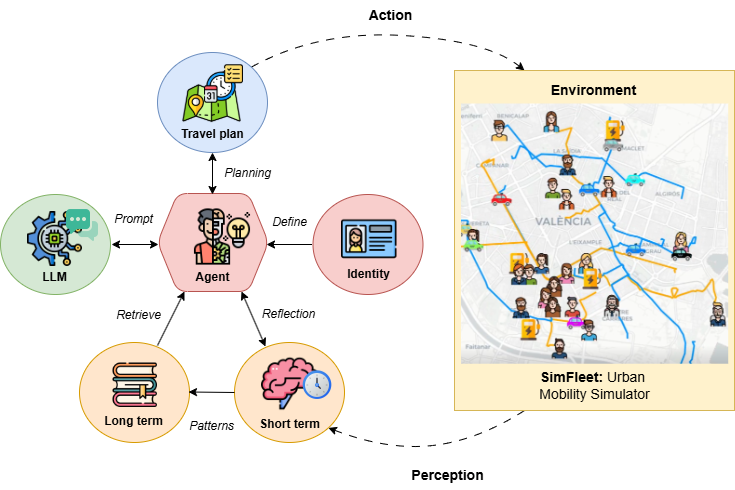

SimfleetDataBridge
==================

A Python toolkit for urban mobility simulation, combining cognitively enriched agent-based modeling with Large Language Models (LLMs).
SimfleetDataBridge allows researchers and practitioners to create, manage, and analyze realistic multi-agent simulations featuring rich user profiles and dynamic adaptation to disruptions.

**Figure:** Cognitive architecture of SimfleetDataBridge agents.
Each agent combines sociodemographic identity, multi-horizon memory (short-term and long-term), and LLM-based reasoning to generate and adapt travel plans in response to environmental feedback. The simulation environment (SimFleet) provides realistic multimodal urban mobility and supports agent perception, planning, and action.

Key Features
------------

- Integrates LLM-driven cognitive agents in urban mobility scenarios
- Supports multi-horizon planning, episodic and semantic memory, and agent reflection
- Simulates adaptive user behaviors under both stable and disrupted transport conditions
- Provides a user-friendly GUI for creating user profiles and importing GTFS data for bus fleet configuration
- Command-line tools to run and analyze experiments with hundreds of agents and diverse scenarios

Scientific Context
------------------

Traditional agent-based models (ABMs) for urban mobility often rely on static, rule-based behaviors and lack realistic adaptation to events or disruptions.
SimfleetDataBridge implements a novel cognitive agent architecture based on LLMs, enabling each agent to plan, reflect, and adapt daily decisions using structured short- and long-term memory—capturing emergent, heterogeneous behaviors that align with real-world sociodemographic diversity and mobility priorities.

If you use SimfleetDataBridge in academic work, please cite:

Calderón, C.; Martí, P.; Jordán, J.; Palanca, J.; Julian, V.
*Cognitive Agents in Urban Mobility: Integrating LLM Reasoning into Multi-Agent Simulations*.

Requirements
------------

- Python 3.9 or higher
- tkinter (for the GUI; see installation instructions below)
- See ``requirements.txt`` for Python dependencies

Installing tkinter
------------------

**Windows / macOS**

tkinter is included with the standard Python installation. To check:

.. code-block:: python

    import tkinter

If you see no errors, you are ready to go!

**Linux (Ubuntu/Debian):**

.. code-block:: bash

    sudo apt-get update
    sudo apt-get install python3.9-tk

**Fedora:**

.. code-block:: bash

    sudo dnf install python3-tkinter

Installation
------------

You can install SimfleetDataBridge in two ways:

**Option 1: Clone the repository and install locally**

.. code-block:: bash

    git clone https://github.com/cvcalderon/simfleetdatabridge.git
    cd simfleetdatabridge
    pip install .

**Option 2: Install directly from GitHub using pip**

.. code-block:: bash

    pip install git+https://github.com/cvcalderon/simfleetdatabridge

Launch the GUI
--------------

The GUI is used to **create the `profiles.json` file** (with simulated user profiles) and to **generate a basic `simfleet_config.json` for buses** from a GTFS dataset.
This is the recommended starting point before running simulations.

Typical workflow:

1. **Launch the GUI:**

   .. code-block:: bash

       SimfleetDataBridge launch-gui

2. **In the GUI:**
   - Import a GTFS file to generate the necessary bus configuration.
   - Create or edit user profiles.

3. **Save the generated files** (`profiles.json` and `simfleet_config.json`).

4. **Run the simulation via CLI** using these files as input.

Usage (CLI)
-----------

You can use SimfleetDataBridge via the command line to run simulations.

**Run a simulation via CLI:**

.. code-block:: bash

    SimfleetDataBridge run-simfleetai \
        --base-dir "tests" \
        --name "1sim20days-qwen-test" \
        --framework-config "framework_config.json" \
        --profiles "profiles.json" \
        --sim-config "simfleet_config.json"

Arguments
---------

- ``--base-dir`` (required): Directory where the simulation is located or will be created.
- ``--name`` (required): Name of the simulation.
- ``--framework-config`` (optional): Path to a ``framework_config.json`` file (required for new simulations).
- ``--profiles`` (optional): Path to ``profiles.json`` (required for new simulations).
- ``--sim-config`` (optional): Path to the Simfleet configuration file (required for new simulations).

If the simulation does not exist, the CLI will create a new simulation, setting up all necessary directories and copying configuration files.
If the simulation exists, it will be loaded and executed.

Configuration Files
-------------------

You need three configuration files to create a new simulation:

- **framework_config.json:**
  Defines the model to use (e.g., Qwen, OpenAI, etc.), API endpoints, temperature, and settings for LLM-based decision agents and customer agent classes, as well as environment settings and possible actions.

- **profiles.json:**
  Contains the list of user profiles for the simulation. Each profile defines demographics, mobility preferences, available transport options, and constraints for each simulated user.

- **simfleet_config.json:**
  Specifies the configuration of the simulation fleets (e.g., buses, taxis) and their properties such as speed, lines, agent classes, strategies, and initial positions.
  **Note:** The GUI only generates the bus-related configuration from GTFS. For other fleet types (e.g., taxis), you must edit the JSON manually.

You can find real examples in this repository: https://github.com/cvcalderon/simfleetdatabridge_config.

Author & License
----------------

Author: Christian Calderón Orellana
Email: ccalderon@upv.es
License: MIT

Project page: https://github.com/cvcalderon/simfleetdatabridge

----

